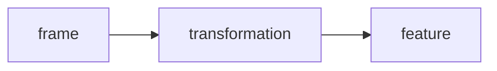

Let's face it. My dive footage is pretty ugly. And so is the code I've been writing.

I mean it's really really hard to hold my camera stable under the water. You'd be surprised at how precise my buoyancy is and how stable I look when I'm filming and then observing the footage and realizing how sloppy it really is.

My goal in this blog is to put some structure around my code base using some design patterns that I've discovered to be the easiest to maintain while also trying to stablize and clean my dive footage before I apply object or motion detection.



To start, we can think about all the things I do to the frame of the video as a `transformation` and lock in that vocabulary. All the data points we gather from the footage we can consider the vocabulary of `features`. Usually, we apply transformations to the footage to obtain features. Sometimes, we apply many transformations in parallel or in sequence in order to obtain the desired feature. With this in mind, we can consider writing some configuration YAML to describe this:

```yaml
config:
    features:
        objects:
            config:
                type: selective_search
                k: 100
                sigma: 0.8
            transformations: 
                - type: scale
                  percent: 0.2
                  interpolation: INTER_LANCZOS4
        motion:
            config:
                pyr_scale: 0.5
                levels: 3
                winsize: 15
                iterations: 3
                poly_n: 5
                poly_sigma: 1.2
                flags: 0
```

Now, like, that's a lot of yaml. And, I really don't think it's nessesary to embed a tunable YAML config into the code base just yet. But, that doesn't mean we can't structure the code with the notion of `features` and encapsulate them into classes or whatever.

```python
class Objects():

    def __init__(self, config):
        self.config = config

    def __call__(self, frame):
        frame = cv2.resize(frame, (0, 0), fx=0.2, fy=0.2, interpolation=cv2.INTER_LANCZOS4)
        ss = cv2.ximgproc.segmentation.createSelectiveSearchSegmentation()
        ss.setBaseImage(frame)
        ss.switchToSingleStrategy(k=100, sigma=0.8)
        rects = ss.process()
        return rects

class Motion():

    def __init__(self, config):
        self.config = config
        self.prev_frame = None

    def __call__(self, frame):
        if self.prev_frame is None:
            return None

        gray_frame = cv2.cvtColor(frame, cv2.COLOR_BGR2GRAY)
        flow = cv2.calcOpticalFlowFarneback(self.prev_frame, gray_frame, None, 0.5, 3, 15, 3, 5, 1.2, 0)
        self.prev_frame = gray_frame

        return flow
```

See? That was easy. Now, when I run my pipeline, it is as simple as typing this:

```python
motion_feature = Motion()
object_feature = Objects()

while True:
    ret, frame = capture.read()
    if not ret:
        break

    motion = motion_feature(frame)
    objects = object_feature(frame)
```

Now, I can focus on the fun part: the actual machine vision aspect of this blog post. So there is this great resource I found on video stabilization in OpenCV that I want to give a shoutout too because I basically stole everything from there. But the whole blog post walks you through how exactly the stabilization is working.

<a href="https://learnopencv.com/video-stabilization-using-point-feature-matching-in-opencv/">Video Stabilization Using Point Feature Matching in OpenCV</a>

<a href="https://github.com/krutikabapat/Video-Stabilization-using-OpenCV">Blog Post Github Source Code</a>

Absolutely brilliant I reccomend you pause here and read these posts. The source code basically works in three parts:

- For all frames, calculate the points of interest and the Lucas-Kanade motion based on of them and measure the affine transformations between the frames.

- Smooth out the transformations so they are not rigid and jittery.

- Apply the smoothed transformations to the frames to stabilize the video.

The below gif shows the result of the unstable and uninteresting part of my dive footage after using this method.

<div style="display: flex; justify-content: center; align-items: center; flex-wrap: wrap; gap: 10px;">
    <div>
        
        <p>Uninteresting Footage</p>
    </div>
    <div>
        
        <p>Interesting Footage</p>
    </div>
</div>

Now, obviously, you'll take note to see that there is something seriously wack about the uninteresting footage. It's basically just non existent. What is going on here? Well since the camera is so shaky we have lost the ability to transform it to a stable state. The generated affine transformations literally move the footage so much that it just moves it out of view entirely. My bad. It's pretty hard to stabilize the footage during the initial part of a free dive.

The interesting footage though still has those black borders which are seriously annoying. Part of this stabilization technique is to actually zoom in on the footage in order to make it appear as though the frame wasn't moved around. However, with enough movement not even the zoom can save us. This should definetely be considered in the hyperparameters of my pipeline but also as a feature to consider. I can tolerate some black bars; there are methods to make those go away. But I can't tolerate too much and I should figure out a way to measure that. Obviously, what we can do, is anaylze the affine transformation variables and graph them. That should be easy!

```python3
dx = transforms_smooth[i,0]
dy = transforms_smooth[i,1]
da = transforms_smooth[i,2]

data.append([frame_index, dx, dy, da])

df = pd.DataFrame(data, columns=['frame_index', 'stabilize_dx', 'stabilize_dy', 'stabilize_da'])

df.to_csv('stabilize_motion.csv', index=False)
```


If you take a look at the <b style="color: green;">green</b> line, the `stabilize_dy` feature, you'll notice that it got a bit out of hand. Like, wildly out of hand. All of the features spiked around that portion of the video though and we should be able to detect those spikes and smooth them out.

Could we have machine learning do that for us? If so, what kind of machine learning might do this for us? What we need is to have `outlier detection` or `anomaly detection`. The scikit-learn website has some great documentation on this: <a href="https://scikit-learn.org/stable/modules/outlier_detection.html">Outlier Detection Methods</a> and I'm gonna brush up on it.

```python
from sklearn.neighbors import LocalOutlierFactor

model = LocalOutlierFactor(n_neighbors=50)

x_train = df['stabilize_dy'].values.reshape(-1, 1)

outlier_factors = model.fit_predict(x_train)

df['outlier_factor'] = outlier_factors
```

Simple! Now the `LocalOutlierFactor` model utilizes K-Means clustering at it's core in order to figure out the density of data points in relation to their neighbors. Pretty cool. And this does a pretty great job at filtering the outliers. BUT that's not really what I want to do. I do need to detect outliers but I don't want to remove them. That affectively would make the video look jittery and not smooth (like what we want). 

In lay mans terms what I need is to make sure that if the footage is really shaky to the point that it flys off the screen that we minimize that so that it only moves it no more than the rest of the footage moves.

Complicated right? Well, I think it might actually be pretty straight forward. I need the global maximum values of the filtered dataframe (the one without outliers) so I can use it as part of the threshold for scaling. We could set a global variable that says: "though shalt pass this affiniy transformative threshold!". And we might have to do that. But I want to see where pure statistics takes us.

```python
filtered_df = df.query('outlier_factor == 1')
filtered_max = filtered_df['stabilize_dy'].max()
```

Then we need to create contiguous sequences of outliers that happen in succession: the outliers appear one right after the other in the original dataframe. This might take a few minutes...

```python
groups = []
group_flag = False
group_lr = []
group_indicies = []
for i in range(0, len(outlier_factors)):
    if i == len(outlier_factors) - 1 and group_flag:
        if outlier_factors[i] == 1:
            group_lr.append(i)
        else:
            group_indicies.append(i)
        groups.append([group_lr, group_indicies])
        break
    
    if outlier_factors[i] == -1 and not group_flag:
        group_flag = True
        if i > 0:
            group_lr.append(i - 1)
        group_indicies.append(i)
    elif outlier_factors[i] == 1 and group_flag:
        group_flag = False
        group_lr.append(i)
        groups.append([group_lr, group_indicies])
        group_lr = []
        group_indicies = []
    elif outlier_factors[i] == -1 and group_flag:
        group_indicies.append(i)
```

Little sloppy. But Github Copilot is pretty badass and helped me through the day. No unit tests of course, but it's okay for now. I just need some data to work with, so lets role with it. Now I need to loop through each group (a contiguous block) and apply a `MinMaxScaler` to it. We will apply this based on the global maximum of the group and the left and right local minimums (whichever is smallest).

```python
from sklearn.preprocessing import MinMaxScaler

scaled_df = df.copy()

for group in groups:
    left, right = group[0]
    indicies = group[1]

    boundary_minimum = min(df['stabilize_dy'][left], df['stabilize_dy'][right])

    scaler = MinMaxScaler(feature_range=(boundary_minimum, filtered_max))

    slice = df['stabilize_dy'][indicies].values.reshape(-1, 1)
    slice = scaler.fit_transform(slice)  

    scaled_df['stabilize_dy'][indicies] = slice.flatten()
```

And bam that seems to work! That crazy section of super extremas have been smoothed out. You'll still see a sharp spike up and then down where the original extremas were. But, I planned for this. Again, I didn't want to cut out those extremas but smooth them out so they were not as extreme.


Boy have we done a lot of work in this post. But I was just too excited I couldn't stop programming and discovering all that was possible. To recap though:

- We reformatted the codebase to fit better software design practices

- We reimplemented a video stabilization technique and explored it's current inefficencies.

- We performed outlier detection on the affine transformations to try and identify the motion that is really crazy.

- We then developed an algorithm that would smooth out the contiguous blocks of outliers to manageable levels.

And I think that it's a pretty solid amount for one post don't you think? But we are far from done with this. The next blog will actually clean up this code, apply the algorithm to the entire affine transformation matrix, and we will actually get to see the result in action after we fine tune the parameters.

For now, stay safe. Peace.


