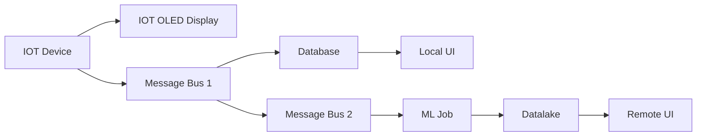

Volcabulary and foundational communication is always needed when discussing programming concepts with a team or management. It is nessasary to build up a language that can be used universally in your organization so that ideas can be quickly passed around and explored.

One of the concepts that should always be brought up when it comes to your organizations data is: `Encoding`.

## What Is Encoding?

Encoding is how data can be transformed into a format that is efficent for movement, storage, obfusaction, or fast retrieval. It is different from Compression and Encryption, but is somewhat interchangable. The goal of Encoding is not to hide the data or compress it, but to change it into a format that best fits the software applications needs.

A method should always be considered when building a data pipeline and different techniques should be considered depending on where the data is coming from. Some Encoding techniques are optimized for `storage`, some are optimized for `transferability`, and some are for `readability`. Sometimes `compatability` is useful when considering an Encoding technique, but generally the most popular ones are universal acrossed programming languages. Encoding techniques can sometimes be combined to achieve more storage capabilities as well.

Generally, an encoding technique has a `schema` associated with it. Some encoding techniques use an external one, like `avro` or `protobuf`. Some embed the schema within the data itself, like `xml` or `json`. Some, may have the schema defined as part of a library or algorithmic implementation, like `base64` or `gzip`.

## Why consider?

Say you have a high volume sensor that produces a 32 bit number every 0.1 seconds. So, over the course of a day that's 864000 * 32 = 27648000 bytes. Now, you deploy an army of them (50 sensors) and that generates 27648000 * 50 = 1382400000 bytes or 1.3824 gigabytes every day. Over the course of a year, you have half a terabyte (504.576 gigabytes) of completely raw data that needs to be passed around your organization. Now, consider the fact that you need another few bytes for a timestamp for each number, and some more bytes to define the ID of the sensor, the location, the machine it's deployed on, on and on and on... and you realize that your 50 sensors you deployed now produce 5 terabytes of data per year. That's some serious data.

When your machine learning engineer comes to you an asks you for the last five years of data, and you provide an SCP link to a raw 25 terabyte file, he/she is going to hate your guts (and so will your manager).

But, if I plan ahead, I can define an `Encoding plan` to turn that 25 terabyte flat file into 100 megabyte sized files in object storage, with `Parquet` and `GZIP` format and compression, with `SQL` compatability, and a total storage size of only 5 terabytes in size. Now, best case senario, your machine learning engineer will never email you back asking why they can't get your data.

All the numbers here are somewhat arbitrary but you can see that with a plan you can seriously reduce the storage needs for your data and provide efficent and fast retrievel of it for your endusers. When it comes down to it: an Encoding plan saves a lot of money and time.

## Techniques

Now, there are many many techniques for data Encoding, even one that I've developed: <a href="https://github.com/jackmead515/rust_jsm_encryption">JSM Encryption</a>. But, some are better than others for certain applications. Using the same terminology above, here is a cheat table that can be used for reference. :smile: is good, :sob: is bad, :confused: is inbetween.

| Technique | Storage | Transferability | Readability | Compatability |
| ---- | ---- | ---- | ---- |
| Avro | :smile: | :smile: | :confused: | :smile: |
| Protobuf | :smile: | :smile: | :confused: | :smile: |
| Parquet | :smile: | :confused: | :sob: | :smile: |
| JSON | :sob: | :smile: | :smile: | :smile: |
| XML | :sob: | :confused: | :confused: | :smile: |
| YAML | :confused: | :smile: | :smile: | :smile: |
| CSV | :smile: | :confused: | :smile: | :smile: |
| BASE64 | :sob: | :smile: | :sob: | :smile: |
| GZIP | :smile: | :smile: | :sob: | :smile: |
| Markdown | :sob: | :sob: | :smile: | :smile: |

Complain about the scoring system all you want but overall I think most people would agree along similar emojis. Note that a lot of things are not considered in the scoring system and further exploration should be done to consider if the technique is right for the application.

## Data Pipeline

A great way to discuss the different techniques is to start by laying the foundation for the different areas in which Encoding can be applied. I'll lay out some vocabulary in the senario of an IOT device that generates some data that needs to be view by different operators, needs to have machine learning run on top of it, and needs to be stored for very long time frames. Something like this:



### IOT Device

The IOT device might contain some firmware that reads from an electronic sensor and spits out some data on an interval. The code compatability might be low as it may need to be written in C or Rust and memory constrains will need to be considered so big libraries can't be installed. Overall, it needs to be very lightweight and only spit out exactly what it needs too. In my work, I've always written my own technique as it requires very little code and effort while keeping the package very small. A good technique could be something like:

```
[ num of bytes in message ] [ 32 bit integer code for sensor data ] [ sensor data ]
```

This makes for a compact and storage efficent format, but, it's compatability is very low and hardly readable. Still, you are resource limited. So have some fun!

### IOT OLED Display

This display may be a local HMI interface that a user has to integrate with in order to view the sensor locally. Typically, HMI vendors will have some sort of `Modbus`, or `JSON` protocol that needs to be used. Or, this display is apart of the device itself and in that case, the raw sensor data can just be displayed.

### Message Bus 1

This message bus is the initial bus that will take the raw IOT device data and package it for transfer around the warehouse, or region, or whatever. It may pick up the raw data and just use that. But for this application, the most high volume of data is going to exist which will require a lot of compression. My suggestion is to package it in `Avro` or `Protobuf` and `GZIP` compress it. But if you used a custom protocol for the IOT Device, then that would probably be the most compressed format to use.

### Database

This database serves are a local repository for short term temporary viewing of sensor data for operational decision making. It needs to store data for about a week, and store all of the raw data thereof. Typically, databases have there own in-house encoding format. But, if you are just saving the data to a file, then `Parquet`, `Avro`, or `Protobuf` should be used. `GZIP` can be used, but, it may be that the end device is resource limited (like a Raspberry Pi or a small edge device) so the extra compute costs may need to be considered.

### Message Bus 2

This message bus may be in the cloud or remotely and is MASSIVE. It contains all the sensor data for many months to feed a Spark or Machine Learning application. Readability shouldn't be a concern here, but storage and transferability are a must. Compatability should be taken into account so that your Spark or ML job can read it efficently. In that case, `Avro`, `Protobuf` with some `GZIP` thrown on there is an absolute must to be most effective.

### ML Job

This job could be a Spark job or custom ML pipeline that needs to read a high volume of data, aggregate or make a predicition, and spit something back out to a datalake for longer term storage. The possibilities are endless here, as some ML jobs spit out realtime data or aggregate data. But in the case of aggregate data, some `JSON` or `YAML` could work just fine. But, best to stick with `Avro` or `Protobuf` to gain those extra bytes back.

### Datalake

Now, storage in a Datalake typically means you need to store massive amounts of data for a very very long time: years or decades. The data may also have to be encrypted for security reasons so that will add up on the bytes. `Parquet` is the most reccomended format as it stores data columnarly so end applications only have to select upon the column they need instead of the entire row. `GZIP` again should be an absolute must.

### Remote UI

This UI doesn't need very fast retrieval, but may need to download a lot of data to graph it or generate a report. In any case, `YAML` or `JSON` is just fine for this type of application As it's extremely compatabile with Javascript in the web browser. `Protobuf` and `Avro` could still be used though as there are libraries for it.

## Conclusion

This overview of different Encoding techniques was only about a single application: a data pipeline. But there are many other applications like: a chat application, news articles, or a code sharing app like Github. And we haven't even touched on video or image data! But having a strategy for what techniques you are going to use for your application should be known far before you even touch the keyboard (well, before you start to code).

I hope you learned something from this. But if not, make a PR on my Github with your complains and I'll see what I can do. No promises :)
